# 使用機器學習探討總經因子對S&P500的預測能力

此Project建立完整Data ETL pipeline供前端模型探討總經因子對美股大盤(S&P500走向)的預測能力。

旨在練習資料工程所需技術，包括但不限於:

#### ・設計完整ETL Data pipeline

#### ・MachineLearning

#### ・資料庫設計

#### ・API串接

#### ・Advanced Python Data Manipulation

#### ・Advanced SQL Query

#### ・Linux Shell Scripting

#### ・Git 版本控制

## 後端Data ETL pipeline
資料總共分成兩大部分:S&P500股價資料、總經因子資料。

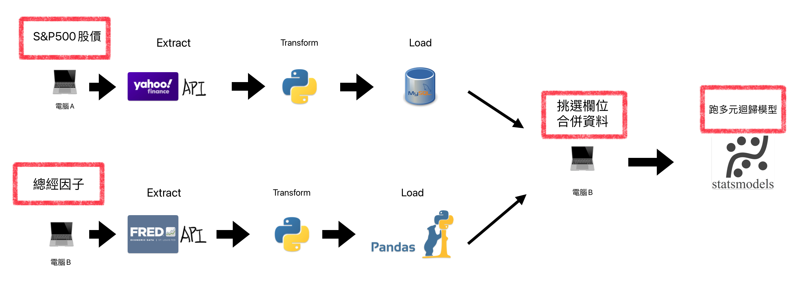
(Data ETL pipeline示意圖)

### S&P500股價資料

#### 《Extract》

建立MySQL資料庫

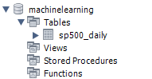

從Yahoo Finance API串接S&P500股價資料

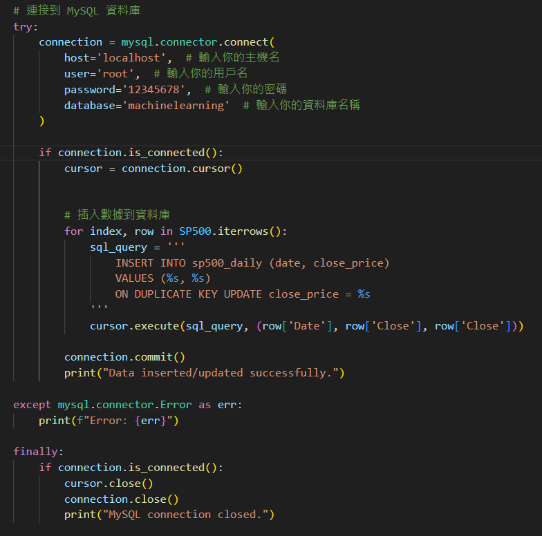

#### 《Transform》

在python裡選定所需欄位、轉換日期欄位格式

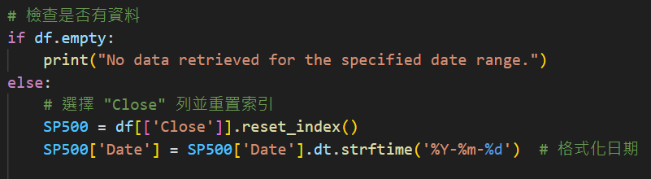

#### 《Load》

將資料用python加載到先前建立的MySQL資料庫

撰寫bash腳本執行python腳本，每日自動獲取最新S&P500股價

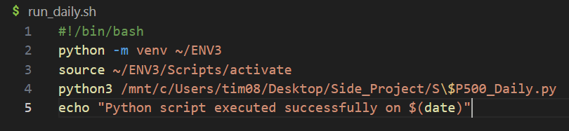

撰寫bat腳本使用每日定期執行bash腳本

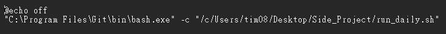

### 總經因子資料

#### 《Extract》

從FRED API獲取總經因子資料。

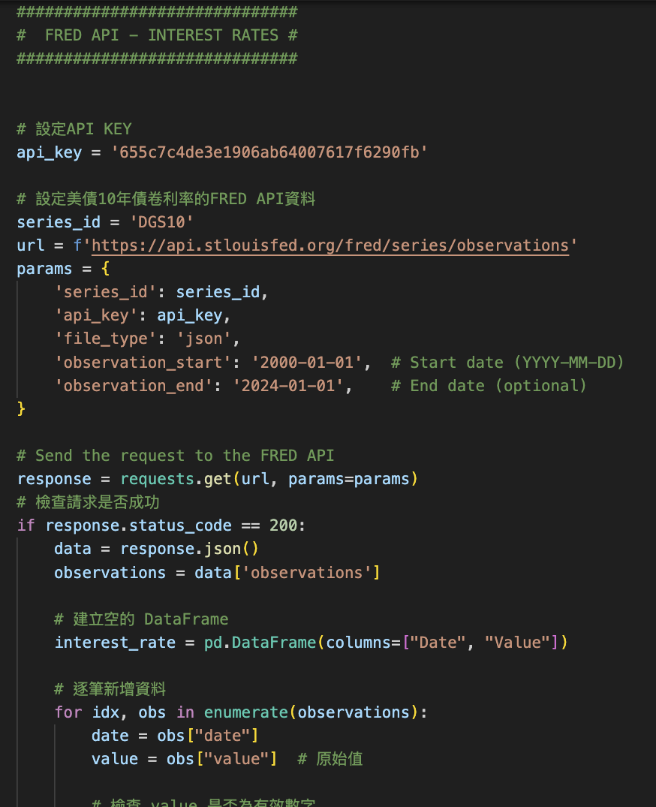

#### 《Transform》

在python裡將資料欄位和日期欄位做轉換、清洗、合併。

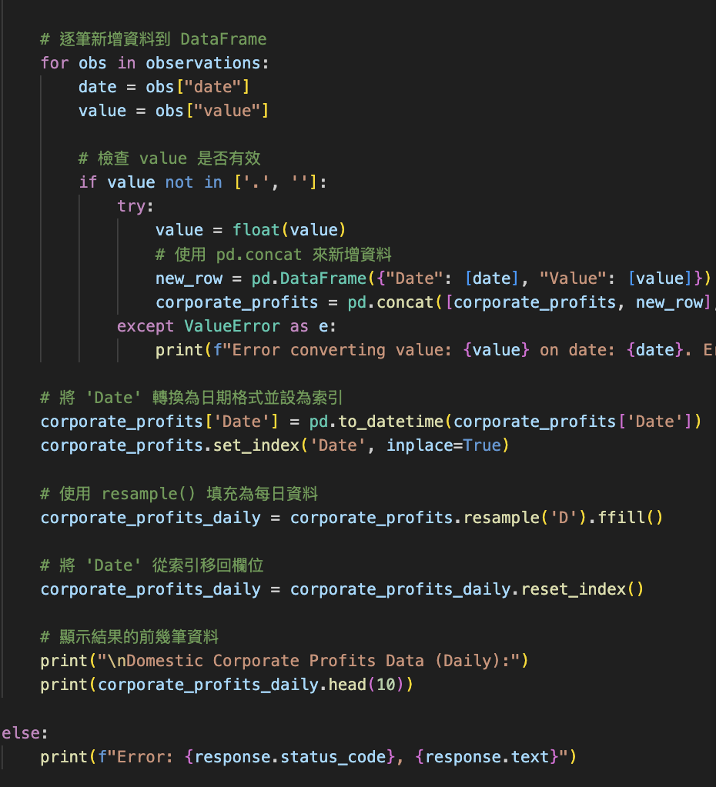

#### 《Load》

直接匯集成一張dataframe灌進模型裡。

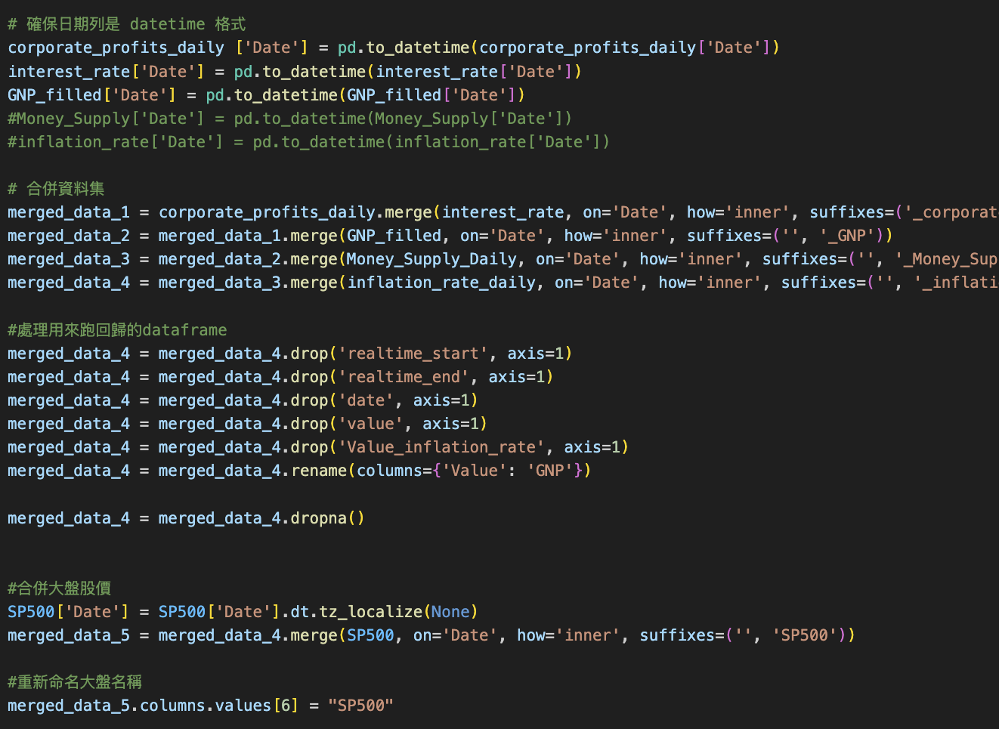

## 前端機器學習模型

(模型程式碼結構簡易示意圖)

使用GitHub進行雲端的版本控制。

這裡機器學習算法使用"多元迴歸"。

#### Y = β0 + β1X1 + β2X2 + β3X3 + β4X4 + β5X5

#### 《目標變數》:

##### S&P500收盤價

#### 《自變數》:

#### 1.國內公司利潤:
Lorie and Hamilton（1973）指出公司利潤是影響股票價格的最重要因素之一。
他們觀察到在經濟衰退期間，公司利潤和股票價格都大幅下降，顯示公司利潤的變動與股票市場具有顯著相關性。

#### 2.Real GNP
Real GNP的成長反映經濟活動的增強。經濟成長能夠提高企業的盈利能力，進而推動股價上漲。
Ezra Solomon（1955）指出，Real GNP 與S&P500之間存在正向關係，隨著Real GNP 的增加，股價也會增長，因為企業收益和投資機會的增加會帶動投資者信心。

#### 3.通膨率:
Kessel（1956）指出，通膨率會增加企業的利潤，尤其是當通脹導致收入從勞工階層轉向資本階層時，這會推動股價上升。
通膨率因此被認為是影響大盤的重要自變數。

#### 4.貨幣供應增長率:
Sprinkel（1971）的研究指出，貨幣供應增長率會增加市場的流動性，從而提高股市的需求並推動股價上升。
因此，貨幣供應增長率被認為是影響大盤的重要自變數。

#### 5.美債利率：
利率上升時，企業未來的收益會以更高的折現率進行折現，從而降低其當前價值。

### 程式碼

S&P500股價資料從遠端Windows主機的MySQL截取

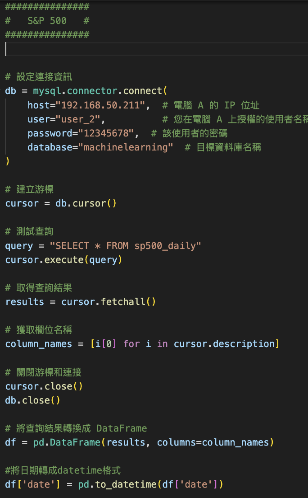

使用statsmodels套件進行機器學習統計分析

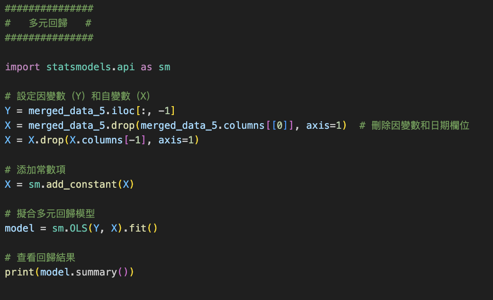

#### Predict_Value v.s. Real_Value
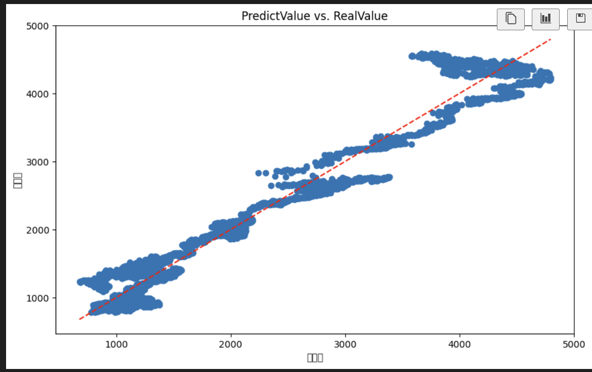

#### 模型統計結果
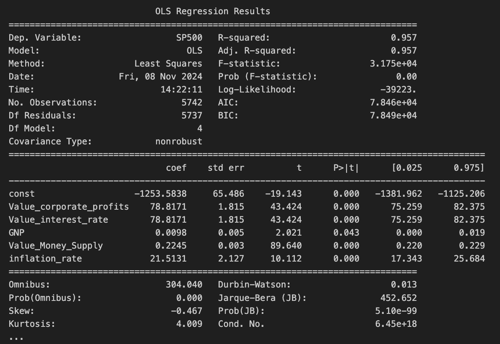

Predict_Value v.s. Real_Value圖中表示模型之具有對S&P500股價的預判能力。
從上圖可以得知各因子的P_Value接小於0.05，調整後的 R²達到0.957，
各項指標皆表示各因子對S&P500股價都有強烈的解釋能力。
但是，Durbin-Watson檢驗數值趨近於0，
表示殘差之間存在明顯正相關性。
殘差之間的正相關會導致t統計量和F統計量失效，P_Value被錯誤估計。
換言之，上述圖中所顯示出的"各因子對S&P500股價都有強烈的解釋能力"這結果是無效、錯誤的。

此問題的根本原因是因為我用週期性資料（ex:Real GNP是一年一筆，貨幣供應增長率是一個月一筆)
去Resample成每日資料來對應S&P500每日股價去跑多元迴歸模型。

接下來的改進可以朝適合處理週期性資料的算法模型（ex:ARIMA、SARIMA 等)，或重新篩選因子邁進。

